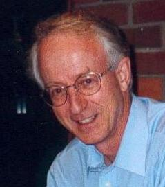

Philip Hazel
============

Email: localpart=ph10 domain=cus.cam.ac.uk

Er, I suppose I'd better say something. I wrote Exim for use at the
University of Cambridge, thinking maybe a few other places would pick it
up. I'm still flabbergasted at how widely it has spread. For those who
want to know more about me, here's the BIO that I give to conference
organizers:

* * * * *

> Philip Hazel grew up in South Africa. He has a PhD in applied
> mathematics, and has spent the last 30 years writing general-purpose
> software for the Computing Service at the University of Cambridge in
> England. Some major projects were text editors and text formatters for
> use on an IBM mainframe system. Since moving from the mainframe to
> Unix around 1990, he has become more and more involved with email.
> This lead to his starting to develop Exim in 1995, and the PCRE
> regular expression library two years later. These open source projects
> have both turned out to be larger and more successful that expected.
> Outside interests include classical music (as a choral singer and late
> convert to viola playing), music typsetting, working backstage in
> amateur theatre, and finding nice places to go walking, preferably not
> as flat as Cambridgeshire. Philip is married, and has three grown-up
> sons.

* * * * *

You want a picture? Hmm, let's see if I can learn how do that ... Here
you go...

_(migrated old wiki user profile page)_
